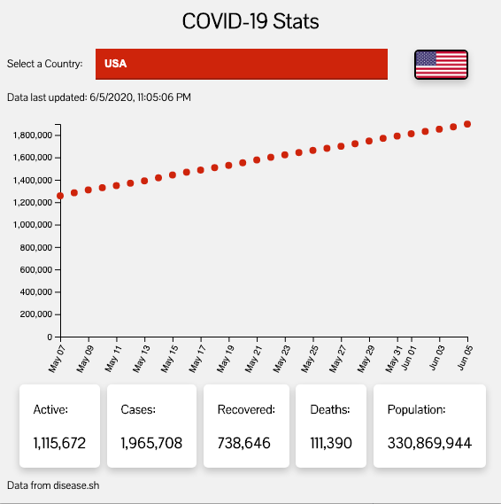

# COVID-19 Stats
Quick access and convenient dashboard extension for statistics regarding the COVID-19 global pandemic.

## How to install in Chrome
- Click the "Clone or download" button
- Click the "Download ZIP" button
- Unzip the downloaded file
- Go to [chrome://extensions/](chrome://extensions/)
- Click the "Load unpacked" button
- Select the unzipped folder i.e. the the folder with the `manifest.json` file in it
- Profit!

## License
MIT License

## Copyright
© 2020 Abhishek Babu, Kevin Zhu